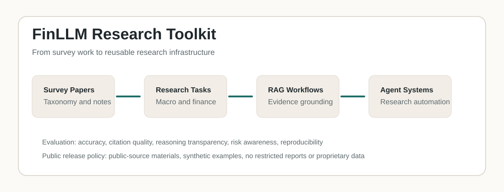
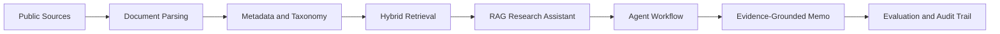

# FinLLM Research Toolkit


Open research assets for financial large language models, macroeconomic research automation, RAG workflows, agent systems, and evaluation design.

<p align="center">
  
</p>

## 中文简介

这个仓库整理金融大语言模型相关的开放研究材料，重点服务于宏观经济研究自动化、金融文本理解、RAG 检索增强生成、agent 研究工作流和评测标准设计。

它不是单纯存放论文 PDF 的资料夹，而是把综述工作进一步整理成可复用的研究工具包，包括：

- 金融大模型文献 taxonomy；
- 宏观经济研究任务地图；
- RAG 与 agent 工作流设计；
- 金融研究场景下的大模型输出评测 rubric；
- 可公开分享的 synthetic examples 和模板。

本仓库只放公开、非敏感、可复用的研究材料，不包含内部报告、非公开数据、受限文档或专有数据集。

## Why This Repository Exists

Financial LLM research is moving quickly, but a lot of material remains scattered across papers, demos, benchmarks, and implementation notes. This repository turns the survey work into a more usable research infrastructure:

- a taxonomy for organizing financial LLM papers;
- a task map for macroeconomic and financial research automation;
- a RAG and agent workflow blueprint;
- evaluation rubrics for financial accuracy, citation quality, and reasoning transparency;
- lightweight synthetic examples that can be shared publicly.

The repository is intentionally designed to be public-source friendly. It excludes private reports, confidential data, restricted documents, and proprietary datasets.

## Repository Map

| Path | What it contains | Why it matters |
| --- | --- | --- |
| `publications/` | Survey PDF and public paper assets | Connects the toolkit to the underlying research agenda |
| `docs/rag_agent_blueprint.md` | Retrieval, agent, output, and verification design | Shows how to build evidence-grounded financial research workflows |
| `docs/evaluation_rubric.md` | Evaluation dimensions and scoring guidance | Makes LLM outputs auditable and comparable |
| `docs/roadmap.md` | Development plan | Shows what will be added next |
| `data/finllm_taxonomy_template.csv` | Paper taxonomy template | Helps classify papers by domain, task, model, and data |
| `data/macro_research_task_map.csv` | Research-task inventory | Connects LLM methods with macro research use cases |
| `examples/synthetic_macro_rag_example.md` | Public synthetic example | Demonstrates workflow structure without restricted data |

## 中文目录说明

| 路径 | 内容 | 用途 |
| --- | --- | --- |
| `publications/` | 公开综述论文或预印本材料 | 连接论文成果和开源工具 |
| `docs/rag_agent_blueprint.md` | RAG 和 agent 研究流程设计 | 展示如何做可追溯的金融研究自动化 |
| `docs/evaluation_rubric.md` | 评测维度和评分标准 | 让大模型输出可以被标准化评估 |
| `data/finllm_taxonomy_template.csv` | 金融大模型文献分类表 | 用于整理文献、模型、任务和数据 |
| `data/macro_research_task_map.csv` | 宏观研究任务地图 | 把金融研究问题转成可执行的 LLM 任务 |
| `examples/` | synthetic demo | 避免敏感数据，同时展示方法结构 |

## Research Pipeline



## Core Research Modules

### 1. Financial LLM Taxonomy

The taxonomy organizes papers and systems by:

- model family and adaptation method;
- financial domain, such as macro, markets, banking, risk, or supervision;
- task type, such as extraction, reasoning, forecasting, retrieval, or agent workflow;
- data source and evaluation method;
- contribution and limitations.

### 2. Macroeconomic Research Automation

This module maps LLM capabilities to practical research tasks:

- policy document summarization;
- macro theme extraction;
- indicator explanation;
- literature mapping;
- research memo drafting;
- evidence log generation.

### 3. RAG and Agent Workflows

The RAG and agent notes focus on:

- source provenance;
- hybrid retrieval;
- citation discipline;
- human-in-the-loop review;
- multi-step research workflows;
- quality control before publication.

### 4. Evaluation

The evaluation rubric covers:

- financial accuracy;
- evidence grounding;
- reasoning quality;
- domain relevance;
- risk awareness;
- reproducibility;
- professional communication.

## Quick Start

Clone the repository:

```bash
git clone https://github.com/yuedai-pbc/finllm-research-toolkit.git
cd finllm-research-toolkit
```

Open the main assets:

```text
publications/financial-llm-survey-domain-adaptation-agentic-intelligence.pdf
docs/rag_agent_blueprint.md
docs/evaluation_rubric.md
data/finllm_taxonomy_template.csv
data/macro_research_task_map.csv
```

Suggested first use:

1. Add papers to `data/finllm_taxonomy_template.csv`.
2. Map your research task in `data/macro_research_task_map.csv`.
3. Use `docs/rag_agent_blueprint.md` to design the retrieval and agent workflow.
4. Score outputs with `docs/evaluation_rubric.md`.

## 中文快速使用

建议从这几步开始：

1. 在 `data/finllm_taxonomy_template.csv` 里补充金融大模型论文。
2. 用 `data/macro_research_task_map.csv` 把你的宏观研究任务拆成 LLM 可执行任务。
3. 用 `docs/rag_agent_blueprint.md` 设计检索、引用、agent 和质量控制流程。
4. 用 `docs/evaluation_rubric.md` 对模型输出进行评分。

这里的 rubric 可以理解为“评测量表”或“评分标准”。它的作用是把模型输出从“看起来不错”变成可以按维度评估，例如事实准确性、证据引用、推理透明度、风险意识和可复现性。

## Example Use Cases

| Use case | Input | Output |
| --- | --- | --- |
| Literature mapping | Paper abstracts and metadata | Taxonomy table and reading map |
| Policy memo drafting | Public central bank reports and speeches | Evidence-grounded memo outline |
| Macro theme extraction | Public reports and releases | Theme table with source references |
| RAG prototype design | Public documents and metadata | Retrieval workflow and citation log |
| Agent workflow design | Research task decomposition | Multi-agent research pipeline |

## Public Release Policy

Included:

- public survey materials;
- synthetic examples;
- templates;
- non-sensitive methodology notes;
- public-source taxonomies.

Excluded:

- private reports;
- non-public policy documents;
- institutional confidential materials;
- copyrighted full-text papers without redistribution rights;
- proprietary datasets or model weights.

## Roadmap

- [x] Add financial LLM survey PDF.
- [x] Add taxonomy and macro task templates.
- [x] Add RAG and agent workflow blueprint.
- [x] Add evaluation rubric.
- [ ] Add paper-level taxonomy entries for major financial LLM studies.
- [ ] Add a small public-document RAG demo.
- [ ] Add a literature-mapping notebook using public metadata.
- [ ] Add a demo video or screen recording after the first runnable prototype is ready.

## Citation

If this repository is useful for your research, please cite the repository and the related survey paper.

```bibtex
@misc{dai_finllm_toolkit_2026,
  title  = {FinLLM Research Toolkit},
  author = {Dai, Yue},
  year   = {2026},
  note   = {Open research toolkit for financial large language models}
}
```

## Contact

For research collaboration, please open an issue or contact Yue Dai through the personal webpage linked from the GitHub profile.
